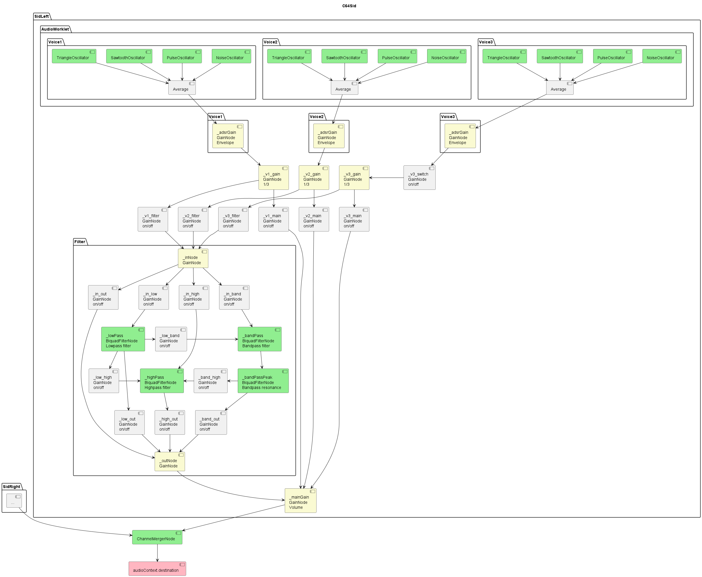

# SID-Player

A modern parser and player for C64 SID files using the Web Audio API.

## Overview

This SID-Player is a modern reimplementation of the classic Sidplayer by Craig Chamberlain in TypeScript. It uses the Web Audio API to reproduce the sound of the C64 SID chip. Like the original player it displays the played notes in real-time on a virtual piano keyboard. A number of songs can be selected from a drop down menu. Additionally files can be selected from the local drive (e.g. downloaded from [Compute's Gazette Sid Collection](https://www.c64music.co.uk/)).

### Key Features

- Supports all features of the original Sidplayer
- Implementation of core SID chip functionalities
- Pure TypeScript implementation without external dependencies

## Live Demo

A live version of the player is available here:
https://stevi84.github.io/sidplayer/

## Technical Details

### Web Audio API Integration

The player uses the Web Audio API for audio processing. The following diagram shows the structure of the audio network:



### Known Limitations

- Advanced Sidplayer features not yet implemented
- Waveforms were intendedly not exactly copied from the C64

Command | Description | Supported
--- | --- | ---
def | Define phrase | ✓
cal | Call phrase | ✓
end | End phrase | ✓
hed | Repeat head | ✓
tal | Repeat tail | ✓
tem | Tempo | ✓
utl | Utility duration | ✓
vol | Volume | ✓
bmp | Increase/Decrease volume | ✓
f-m | Filter mode | ✓
aut | Auto filter voice | ✓
res | Filter resonance | ✓
flt | Filter voice | ✓
f-s | Filter sweep | ✓
f-c | Filter cutoff | ✓
f-x | Filter external audio | ✓
atk | Attack rate | ✓
dcy | Decay rate | ✓
sus | Sustain level | ✓
rls | Release rate | ✓
pnt | Release point | ✓
wav | Waveform | ✓
p-w | Pulse width | ✓
p-s | Pulse width sweeping | ✓
snc | Synchronisation | ✓
rng | Ring modulation | ✓
vdp | Vibrato depth | ✓
vrt | Vibrato rate | ✓
por | Portamento | ✓
dtn | Detune | ✓
tps | Transpose | ✓
ms# | Measure | no effect
3-O | Voice 3 off | ✓
flg | Flag | no effect
hlt | Halt | ✓
aux | Auxiliary | no effect
note | Note | ✓
abs | Absolute set pitch | ✓
triplet | Triplet | ✓
rup | Rate up | ✗
lfo | Waveform type | ✗
rdn | Rate down | ✗
src | Modulation source | ✗
dst | Modulation destination | ✗
sca | Modulation scale | ✗
max | Modulation maximum | ✗
pvd | Pulse-width vibrato depth | ✗
pvr | Pulse-width vibrato rate | ✗
utv | Utility voice | ✗
hld | Hold time | ✗
jif | Jiffy length | ✗
p&v | Portamento & vibrato | ✗
rtp | Relative transposing | ✗

## Installation and Usage

```bash
git clone https://github.com/stevi84/sid-player.git
cd sid-player
npm install
npm start
```

## Further Resources

For further information about the Sidplayer and C64 SID technology:

- [All About the Commodore 64 Volume Two by Craig Chamberlain](https://archive.org/details/All_About_the_Commodore_64_Volume_Two_1985_COMPUTE_Publications/)
- [Compute!'s Music System for the COMMODORE 128 & 64 - The Enhanced Sidplayer by Craig Chamberlain](https://archive.org/details/Computes_Music_System_for_the_Commodore_128_and_64/)
- [The SID Homepage](http://www.sidmusic.org/sid/)
- [C64 SID CHIP MOS6581](http://www.dopeconnection.net/C64_SID.htm)
- [Technical SID Information/Software Stuff](http://www.sidmusic.org/sid/sidtech2.html)
- MUS file format: https://www.c64music.co.uk/CGSC_v146.7z -> /CGSC/00_Documents/MUS_format_A.txt & MUS_format_B.txt

### Songs
- [Compute's Gazette Sid Collection](https://www.c64music.co.uk/)

## License

This project is licensed under the MIT License. See the [LICENSE](LICENSE) file for details.

## Contributing

Contributions to the project are welcome! Please submit a Pull Request or report issues via the Issue Tracker.
